<h3>
<code>abhinav@github ~ $ ./contributions.sh</code>
</h3>

 
 

<h3>
<code>abhinav@github ~ $ whoami</code>
</h3>

<table>
<tr>

<td valign="top">

</td>

<td valign="top">

</td>

</tr>
</table>

 

<h3>
<code>abhinav@github ~ $ ls ./skills</code>
</h3>

<code>
Python • Java • C • SQL • Linux • Networking • Nmap • OSINT
</code>

 
 

<h3>
<code>abhinav@github ~ $ cat ./current-focus</code>
</h3>

<code>
Cybersecurity • Network Security • Web Security • OSINT • CTFs
</code>

 
 

<h3>
<code>abhinav@github ~ $ echo "keep_learning"</code>
</h3>

<code>
&gt; Learn. Break. Understand. Build again.
</code>

